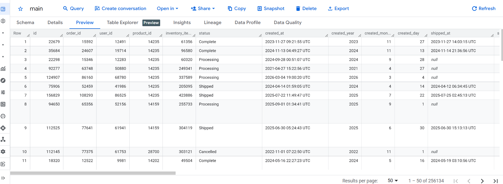
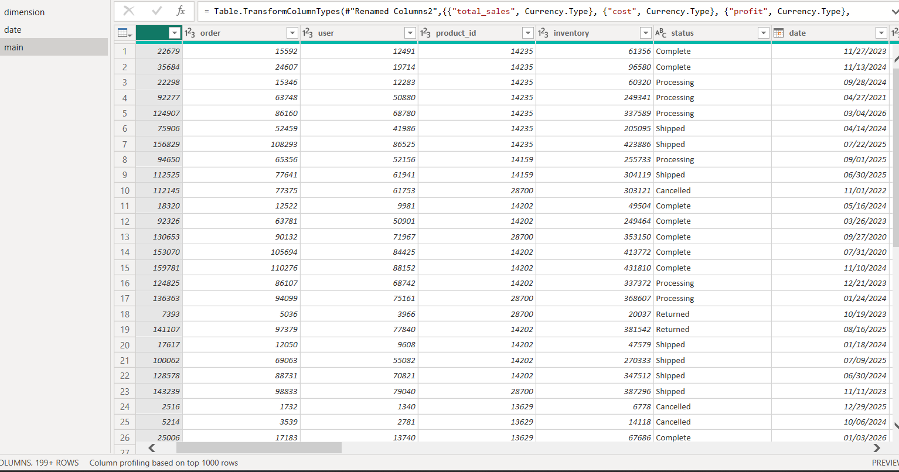
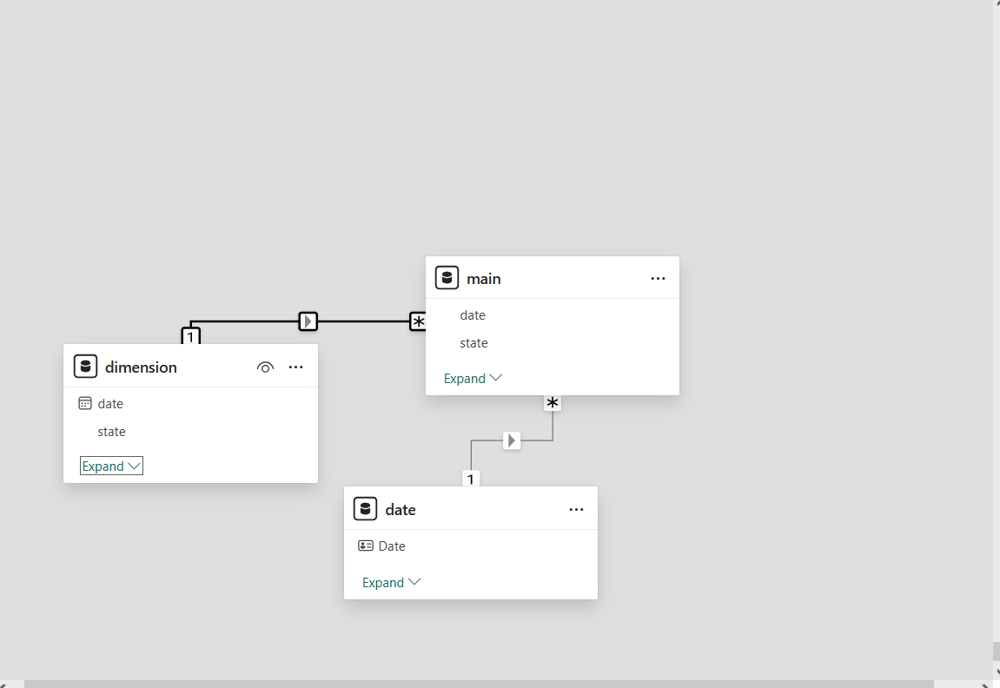
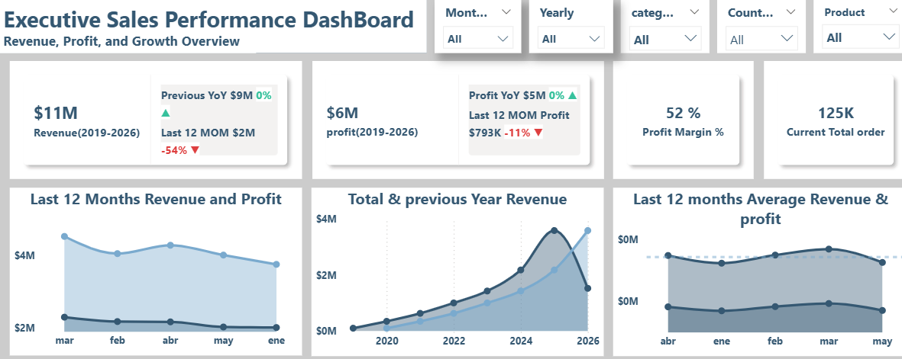
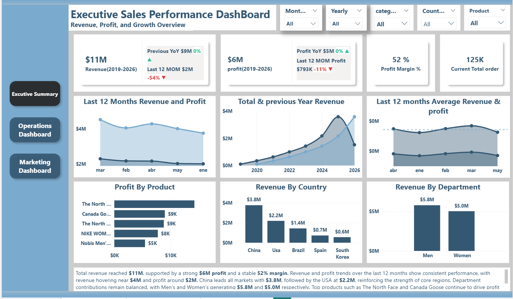
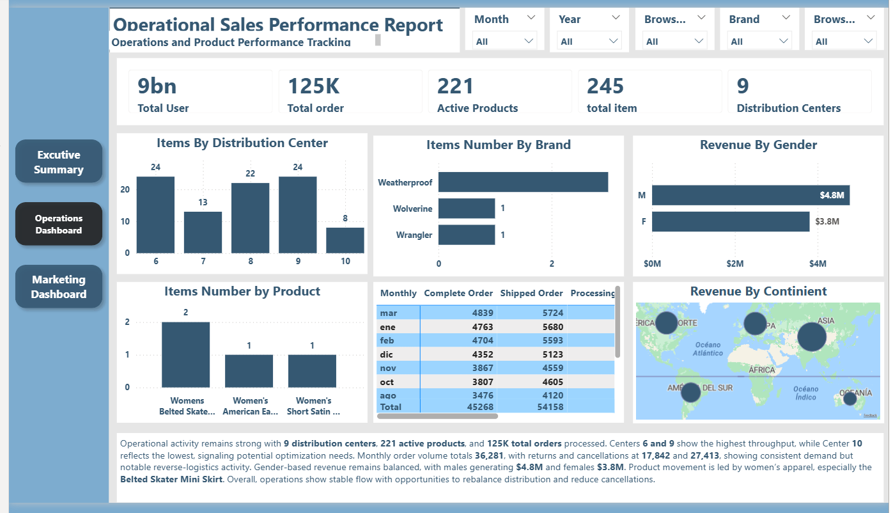
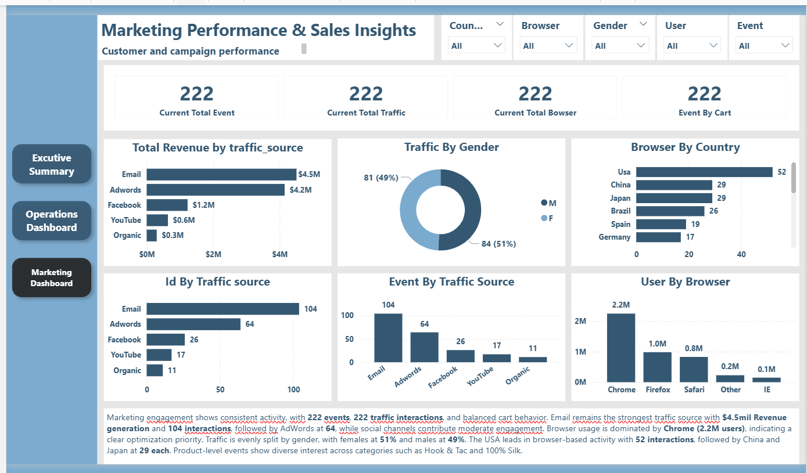

# E-Commerce-Performance-Analysis
### Prepared by: **Emeka Victor Agbo (Senior Data Analyst)**
### Audience: **Leadership, Operations, Marketing**
### Objective: **Provide a unified, insight driven view of company performance across Revenue, Operations, and Marketing**

## Table of Contents
   - [Introduction](#introduction)
   - [Project Request](#project-Request)
   - [Dataset](#dataset)
   - [Data Cleaning & Transformation](#data-cleaning--transformation)
   - [Reports](#reports)
   - [Dashboard](#dashboard)
   - [Recommendations](#recommendations)

## [Introduction](#introduction)
### Introduction
This project analyzes the performance of a fashion e-commerce business using transactional, customer, and web activity data.
The objective is to transform raw data into actionable insights that support decision-making across leadership, operations, and marketing teams.
The analysis covers the period 2019–2026, with over 181,000 transactions, providing a comprehensive view of business performance, customer behavior, and operational efficiency.

### Business Context
The business operates as an online fashion retailer, similar to companies like ASOS or Zalando, managing end-to-end e-commerce operations.
Its core activities include:
-	Product catalog management (categories, brands, departments)
-	Customer orders and transactions
-	Inventory and product cost tracking
-	Distribution center operations for order fulfillment
-	Website activity (traffic sources, sessions, user behavior)
As the business grows, it faces increasing complexity in understanding performance across multiple areas.
Key challenges include:
-	Limited visibility into revenue and profitability trends
-	Difficulty identifying top-performing vs underperforming products
-	Inefficiencies in distribution center operations
-	Lack of clarity on marketing effectiveness and customer acquisition channels
To remain competitive, the business requires a data-driven approach to monitor performance and identify opportunities for improvement

## [Project Request](#project-Request)
###  Project Overview
This project delivers a data analytics solution through the design of three interactive dashboards, each tailored to a specific business function:
-	Executive (Strategic View)
-	Operations (Performance & Efficiency)
-	Marketing (Customer & Channel Insights)
Using SQL (BigQuery) for data extraction and transformation, and Power BI for visualization, the project focuses on:
-	Analyzing revenue, profit, and growth trends
-	Evaluating product and distribution performance
-	Understanding customer behavior and traffic sources
-	Connecting marketing activity to revenue outcomes
The goal is to enable stakeholders to monitor performance, identify issues, and make informed decisions quickly.

### Business Objective
The primary objective is to provide clear, actionable insights through structured dashboards that support different teams across the organization.
These dashboards enable stakeholders to:
-	Monitor overall business performance
-	Improve operational efficiency
-	Evaluate marketing effectiveness
-	Support strategic and tactical decision-making

### Dashboard Breakdown
**Executive Dashboard**
Sales Performance Overview (Strategic Level)
Purpose:
Provides leadership with a high-level view of overall business performance to guide strategic decisions.
Key Business Questions:
-	How is revenue performing over time (monthly, yearly)?
-	Is the business profitable?
-	Are we experiencing growth or decline?
-	Which categories and distribution centers drive performance?
-	What are the main customer acquisition sources?
**Key Metrics:**
-	Total Revenue
-	Total Profit
-	Profit Margin (%)
-	Total Orders

 ### Operations Dashboard
Operational Performance & Efficiency
Purpose:
Enables the operations team to monitor product performance and optimize distribution efficiency.
Key Business Questions:
-	Which products generate the highest sales volume?
-	Which products have high return rates?
-	Which distribution centers are underperforming?
-	What customer segments (e.g., gender) drive product demand?
**Key Metrics:**
-	Total Units Sold
-	Total Orders
-	Total Customers
-	Orders by Status (Shipped, Delivered, Returned)
-	Distribution Center Performance
-	Active Products

###  Marketing Dashboard
Customer & Channel Performance
Purpose:
Analyzes how marketing efforts translate into traffic, conversions, and revenue.
Key Business Questions:
-	Where are customers coming from?
-	Which traffic sources generate the most revenue?
-	Which channels drive the highest conversions?
-	What customer segments are most valuable?
**Key Metrics:**
-	Total Website Sessions
-	Traffic by Source
-	Revenue by Traffic Source
-	Orders by Traffic Source
-	Customer Demographics (e.g., Gender)

###  Expected Outcome
By implementing these dashboards, the business will be able to:
-	Track revenue, profit, and growth trends effectively
-	Identify top-performing and underperforming products
-	Improve distribution and operational efficiency
-	Understand marketing performance and ROI
-	Make faster, data-driven decisions with confidence

### Tools & Technologies
-	SQL (Google BigQuery) – Data extraction and transformation
-	Power BI – Data visualization and dashboard development
-	Excel – Data validation and exploratory analysis

   ## [Dataset](#dataset)
   ### Data Source
     -  Data Source: Google Big Query E-commerce store 
     -  Time: 2019-2026 Records: 181,184 Transactions
     
   ### Preview of Bigquery Raw Data

## [Data Cleaning & Transformation](#data-cleaning--transformation)
 -**SQL QUERIES IN BIGQUERY**
  -STEP 1: Understand the Data Model
-**Main joins:**
order_items.product_id = products.id
order_items.order_id = orders.order_id
products.distribution_center_id = distribution_centers.id
Core main table (fact):
 order_items (this drives revenue)
Dimension tables:
-	products 
-	distribution_centers 
-	orders
  ### STEP 2: Create a Base Table
This is how I  structure a clean analysis layer: pulling and joining the table
WITH base AS (
  SELECT
    oi.order_id,
    oi.product_id,
    oi.sale_price,
    oi.status,
    oi.created_at,
    
    p.cost,
    p.category,
    p.department,
    p.distribution_center_id,
    
    dc.name AS distribution_center_name

  FROM `bigquery-public-data.thelook_ecommerce.order_items` oi
  
  LEFT JOIN `bigquery-public-data.thelook_ecommerce.products` p
    ON oi.product_id = p.id
    
  LEFT JOIN `bigquery-public-data.thelook_ecommerce.distribution_centers` dc
    ON p.distribution_center_id = dc.id
)

SELECT * FROM base
LIMIT 100;
## Data CLEANING
### Clean → Transform → Validate
Goal: Remove incorrect, duplicated, or unusable data.
- ### Check for NULL Values
Start by checking critical fields
-SELECT
  COUNT(*) AS total_rows,
  COUNTIF(order_id IS NULL) AS null_orders,
  COUNTIF(product_id IS NULL) AS null_products,
  COUNTIF(sale_price IS NULL) AS null_sale_price,
  COUNTIF(cost IS NULL) AS null_cost
FROM base;
### Remove Invalid Prices
**Check for negative or zero revenue:**
- SELECT *
FROM base
WHERE sale_price <= 0;

### Check for Duplicates
**Since order_items is the fact table, duplicates could exist.**
- SELECT
  order_id,
  product_id,
  COUNT(*) AS cnt
FROM base
GROUP BY order_id, product_id
HAVING COUNT(*) > 1;
### Check Status Values
- SELECT DISTINCT status
FROM base;
**Standardize values like:**
-	Returned 
-	Shipped 
-	Delivered 
-	Cancelled
### Data Transformation
**Create Revenue & Profit Columns**
**Instead of recalculating every time:**
- SELECT
  *,
  sale_price AS revenue,
  (sale_price - cost) AS profit,
  SAFE_DIVIDE(sale_price - cost, sale_price) AS margin
FROM base;
### Data Validation 
**Validate Revenue**
**Compare original main table vs cleaned table.**
- SELECT SUM(sale_price)
FROM `bigquery-public-data.thelook_ecommerce.order_items`;
Then compare with your cleaned base:
- SELECT SUM(revenue)
FROM final_clean_table;
If huge difference → something is wrong.

### Validate Order Counts
- SELECT COUNT(DISTINCT order_id)
FROM final_clean_table;
Compare with:
- SELECT COUNT(DISTINCT order_id)
FROM `bigquery-public-data.thelook_ecommerce.orders`;
They should align (except cancelled logic).

### Validate Profit Logic
**Check if any weird numbers:**
- SELECT *
FROM final_clean_table
WHERE profit > 10000 OR profit < -10000;
Look for anomalies.

### Validate Distribution Centers
- SELECT distribution_center_name, COUNT(*)
FROM final_clean_table
GROUP BY distribution_center_name;

**CREATE OR REPLACE TABLE your_dataset.ecommerce_cleaned AS and exported directly into power Bi**

-SELECT
order_id,
product_id,
distribution_center_name,
category,
department,
State,
City,
Product,
Category,
sale_price AS revenue,
cost,
(sale_price - cost) AS profit,
SAFE_DIVIDE(sale_price - cost, sale_price) AS margin,
DATE(created_at) AS order_date,
EXTRACT(YEAR FROM created_at) AS year,
FORMAT_DATE('%Y-%m', DATE(created_at)) AS year_month,
status,
CASE WHEN status = 'Returned' THEN 1 ELSE 0 END AS is_returned

FROM base
WHERE sale_price > 0
AND order_id IS NOT NULL;

Create temporary table in bigquery and rename it (MAIN).
Export directly to power Bi

## DATA TRANSFORMATION IN POWER BI.
**FIRST TABLE TRANSFORMATION (MAIN)**
**Fact Table**
### Steps performed
- Removed Duplicates = id
- Renamed and Remove duplicate Columns = Removed Duplicates user_id to user, order_id to order, inventory_item_id to inventory, created_at to date
- Changed Type = Renamed Columns date to  date type
- Renamed Columns = Changed Type created_year to year, created_month to  month, created_day to day
- Removed Columns = shipped_at, delivered_at, returned_at
- Renamed Columns= name to product
    Changed Type = Renamed Column total_sales to Currency.Type}, cost to Currency Type, profit to Currency.Type, margin to Percentage Type, verage_margin to Currency Type
### SECOND TABLE TRANSFORMAT (DIMENSION)
**dimension Table**
    - Changed Type= created_at to type date
    - Renamed Columns = Changed Type {created_at to date
    - Removed Duplicates = (Renamed Columns, state),
    - Duplicated Column = (Removed Duplicates, state, state - Copy)
    - Renamed Duplicated Columnstate – Copy to country_group
    - Replaced São Paulo to Brazil
    - Replaced = Rio de Janeiro to Brazil
    - Replaced = Bahia to Brazil
    - Replaced = Minas Gerais to Brazil
    - Replaced = Paraná to Brazil
    - Replaced =Beijing to China
### Grouped countries into continients
- else if [country_group] = "Usa" then "North America"
- else if [country_group] = "Germany" then "Europe"
- else if [country_group] = "Spain" then "Europe"
- else if [country_group] = "Belgium" then "Europe"
- else if [country_group] = "France" then "Europe"
- else if [country_group] = "Poland" then "Europe"
- else if [country_group] = "United Kingdom" then "Europe"
- else if [country_group] = "Austria" then "Europe"
- else if [country_group] = "China" then "Asia"
- else if [country_group] = "Japan" then "Asia"
- else if [country_group] = "South Korea" then "Asia"
- else if [country_group] = "Nepal" then "Asia"
- else if [country_group] = "Australia" then "Oceania"

else "Others"),

- Renamed Column= Added Custom column to Continient ,country_group to Country, order_id  to  order,  user_id to user
- Removed unecessary Columns    = id_1 to user_id_1
- Renamed Column = product_distribution_center_id to product_distribution_center and distribution_center_id to distribution_center
- 
## DAX CALCULATIONS(MEASURES)

- Total Revenue
Total Revenue = SUM('main'[total_sales]) 
- Total profit
Total profit = SUM('main'[profit])
- Total users
Total User1 = SUM(main[user])
- profit margin
Profit Margin % = 
DIVIDE(
    [Total Profit],
    [Total Revenue],
    BLANK()
)
- LAST 12 MONTHS Profit Average =
Last 12 profit Average = 
DIVIDE(
    CALCULATE(
        [Total profit],
        DATESINPERIOD(
            'date'[Date],
            MAX('date'[Date]),
            -12,
            MONTH
        )
    ),
    12
- Last 12 Months Revenue
Last 12 Revenue Average = 
DIVIDE(
    CALCULATE(
        [Total Revenue],
        DATESINPERIOD(
            'date'[Date],
            MAX('date'[Date]),
            -12,
            MONTH
        )
    ),
    12
)
- Counting Order Status
processing order = 
CALCULATE(
    COUNTROWS('main'),
    'main'[status] = "processing"
)
- Active Products
Active Products = 
DISTINCTCOUNT('dimension'[product_name])

- previous Year Sales
Previous Year Sales = 
CALCULATE(
    [Total Revenue],
    SAMEPERIODLASTYEAR('date'[Date])
)
- YOY%
YoY Growth % (Formatted) = 
VAR PrevYearSales =
    CALCULATE(
        [Total revenue],
        SAMEPERIODLASTYEAR('date'[Date])
    )

VAR Growth =
    DIVIDE([Total revenue] - PrevYearSales, PrevYearSales)

RETURN
IF(
    NOT(ISBLANK(PrevYearSales)),

## Cleaned Dataset

### Table Structures and Relationship in Model
The main transactional table containing all order-level data. Each row represents a single transaction.

**Column Name	Description**
 - id	Unique identifier for each transaction
 - order_id	Order reference number
 - user_id	Unique identifier for the customer
 - product_id	Unique identifier for the product
 - category	Product category
 - inventory	Inventory count at time of order
 - status	Order status (e.g., Completed, Cancelled,returned,shipped,)
 - date	Transaction date
 - total_sales	Total revenue generated
 - cost	Cost of goods sold
 - profit	Profit = Total Sales - Cost
 - profit_margin	Profit as a percentage of sales
 - average_margin	Average margin across transactions
 - city	Customer city
 - state	Customer state
 - country	Customer country
 - continent	Customer continent
 - department	Business department

### Dimension Table: 
This table contains descriptive attributes related to products, users, and web activity. It is used to enrich the fact table for deeper analysis.

**Column Name	Description**
 - id	Unique identifier
 - product_name	Name of the product
 - brand	Product brand
 - date	Activity or record date
 - product_distribution_center	Distribution center handling the product
 - city	User location (city)
 - state	User location (state)
 - browser	User browser (e.g., Chrome, Safari)
 - traffic_source	Source of website traffic (e.g., Organic, Paid Ads)
 - event_type	Type of event (e.g., Click, Purchase)
 - num_of_items	Number of items involved in the event
 - iscount	Discount applied (renamed from unclear "coconut")
 - continent	User continent
 - user_id	Unique identifier for the user

##  [Reports](#reports)

 ### Executive Summary 
**Core Insight:** The business is growing steadily, with strong revenue concentration in key markets, balanced departmental performance, and clear opportunities to optimize operations and marketing efficiency.
**Insight across all dashboards:**
-	Revenue reached $11M, with $6M profit and a 52% margin — stable but with room for acceleration.
-	China and the USA are the primary revenue engines, contributing $3.8M and $2.2M respectively.
-	Operations remain strong with 9 distribution centers, though performance varies significantly.
-	Marketing traffic is healthy, but Email and AdWords dominate conversions, while social channels underperform.
 **Executive Dashboard: Company Performance Overview**
Over the 2019–2026 period, the company demonstrates consistent top line growth, supported by a solid profit margin. Revenue trends show resilience, with the last 12 months stabilizing around $4M, while profit remains near $2M.
### Key Insights from the Dashboard**
-	Revenue: $11M total
-	Profit: $6M
-	Margin: 52%
-	Order Volume: 125K total orders
### Growth Trend: Revenue increased steadily from 2020 to 2026
-	Top Markets:
-	China: $3.8M
-	USA: $2.2M
-	Brazil: $1.4M
**Department Performance:**
-	Men: $5.8M
-	Women: $5.0M
### Executive Interpretation
The business is financially healthy. Growth is driven by strong international markets and balanced product departments. Leadership should prioritize market expansion in China and the U.S., while exploring profit optimization in lower margin categories.

### Operations Dashboard: Monthly & Yearly Product Performance
Operational activity is robust, with high throughput across most distribution centers. However, performance is uneven, signaling opportunities for efficiency improvements.
### Key Insights from the Dashboard
-	Total Users: 9B (platform wide activity)-
-	Total Orders: 125K
-	Active Products: 221
-	Distribution Centers: 9
-	Top Performing Centers:
-	Center 6: 24 items
-	Center 9: 24 items
-	Lowest Performing Center:
-	Center 10: 8 items
-	Monthly Order Flow:
-	Peak months: March (4,839 complete, 5,724 shipped)
-	Total shipped: 54,158
-	Total complete: 45,268
-	Gender Revenue Split:
-	Male: $4.8M
-	Female: $3.8M
-	Top Moving Products:
-	Women’s Belted Skater Mini Skirt (2 units)
-	Women’s American Eagle (1)
-	Women’s Short Satin (1)
### Operational Interpretation
-	Distribution centers show imbalanced throughput, suggesting a need for load balancing and capacity planning.
-	Women’s apparel drives product movement — an opportunity to expand inventory depth in this category.
-	Reverse logistics (returns/cancellations) remain high, indicating potential issues in product quality, sizing accuracy, or delivery experience.

### Marketing Dashboard: Customer & Campaign Insights
Marketing engagement is active, with strong traffic and event activity. Email and AdWords remain the highest performing channels, while social platforms show lower conversion potential.
### Key Insights from the Dashboard
-	Total Events: 222
-	Total Traffic: 222
-	Traffic by Gender:
-	Female: 51%
-	Male: 49%
  **Top Traffic Sources:**
-	Email: 104
-	AdWords: 64
-	Facebook: 26
-	YouTube: 17
-	Organic: 11
**Browser Usage:**
-	Chrome: 2.2M users
-	Firefox: 1.0M
-	Safari: 0.8M
**Top Countries by Browser Activity:**
-	USA: 52
-	China: 29
-	Japan: 29
  ### Marketing Interpretation
-	Email is the highest channel, suggesting continued investment in CRM and lifecycle marketing.
-	Chrome dominates user behavior — website optimization should prioritize Chrome performance.
-	Social channels underperform relative to spend; consider reallocating budget toward Email, AdWords, and high intent channels.

  ## [Dashboard](#dashboard)

## [Recommendations](#recommendations)

### Strategic Recommendations 
1. Accelerate Growth in High Performing Markets
-	Expand localized campaigns in China and the U.S.
-	Introduce region specific product bundles and promotions.
2. Improve Operational Efficiency
-	Re-balance workload across distribution centers.
-	Investigate root causes of high return rates.
-	Enhance forecasting for women’s apparel.
3. Optimize Marketing Spend
-	Increase investment in Email and AdWords.
-	Reduce low performing social spending.
-	Improve attribution modeling to better track channel ROI.
4. Strengthen Customer Experience
-	Improve product detail accuracy to reduce returns.
-	Enhance mobile and Chrome browser performance.
-	Personalize user journeys based on traffic sources.
## Final Outcome
By integrating insights from all three dashboards, the business now has a clear, actionable view of its performance across Sales, Operations, and Marketing.

     

